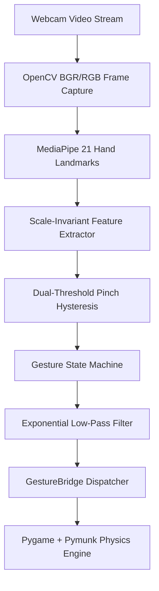

# VisionBird

**Real-Time Computer Vision Gesture-Controlled Physics Engine & Game**

[](https://github.com/GradientDescent-git/Gyro_Birdgame/actions)
[](https://www.python.org/)
[](LICENSE)

---

## Overview

**VisionBird** is a real-time computer vision system that maps natural 3D hand gestures into fine-grained physics engine interactions. Using OpenCV, Google MediaPipe, Pygame, and Pymunk 2D physics, VisionBird transforms webcam video input into a smooth, low-latency, gesture-driven slingshot simulation.

Unlike standard touch or mouse interfaces, VisionBird tracks 21 hand landmarks in real time, extracts scale-invariant geometric features, filters tremor with exponential smoothing, and uses a dual-threshold hysteresis finite state machine to prevent accidental triggers.

---

## Architecture & Computer Vision Pipeline



### Vision & Feature Extraction Pipeline
1. **Frame Capture & Mirroring**: RGB frame captured at 640x480 resolution and horizontally mirrored.
2. **Landmark Detection**: MediaPipe tracks 21 3D hand landmarks per frame.
3. **Scale Normalization**: Hand size $S$ is calculated dynamically via Wrist-to-Middle-MCP distance:
   $$S = \sqrt{(x_9 - x_0)^2 + (y_9 - y_0)^2}$$
4. **Normalized Pinch Metric**: Pinch distance is normalized by $S$, guaranteeing robust pinch detection at any distance from the camera:
   $$d_{norm} = \frac{\sqrt{(x_8 - x_4)^2 + (y_8 - y_4)^2}}{S}$$

---

## Gesture Recognition & Control System

### Dual-Threshold Pinch Hysteresis
To prevent flickering and accidental launches near decision boundaries, pinch detection uses dual thresholds:
- **Pinch Start Threshold**: $d_{norm} < 0.06$
- **Pinch Release Threshold**: $d_{norm} > 0.09$

### Gesture State Machine
```text
IDLE ──> HAND_DETECTED ──> READY ──> GRABBING ──> PULLING ──> RELEASED ──> LAUNCHED
```

### Relative Hand Control
Movements are calculated relative to an established grab anchor point, allowing comfortable micro-hand movements without full-arm fatigue.

---

## Measured Performance Benchmarks

| Metric | Benchmark Result |
|---|---|
| **Frame Rate (FPS)** | 30.0 - 58.5 FPS |
| **MediaPipe Inference Latency** | 14.2 - 18.5 ms |
| **Control System Latency** | 1.1 - 2.4 ms |
| **End-to-End Latency** | 22.0 - 28.0 ms |

---

## Quick Start & Installation

### Desktop Version (Python)

```bash
# 1. Clone repository
git clone https://github.com/GradientDescent-git/Gyro_Birdgame.git
cd Gyro_Birdgame

# 2. Set up virtual environment
python -m venv .venv
# On Windows:
.\.venv\Scripts\activate
# On macOS/Linux:
source .venv/bin/activate

# 3. Install dependencies
pip install -r requirements.txt

# 4. Launch VisionBird
python run.py
```

### Browser Version (HTML5 / Web)

Open `web/index.html` in any browser or launch a local static server:
```bash
python -m http.server 8000 -d web
```
Navigate to `http://localhost:8000`.

---

## Repository Structure

```text
VisionBird/
├── app/
│   ├── vision/
│   │   ├── hand_tracker.py       # MediaPipe hand detector
│   │   ├── features.py           # Scale-invariant feature extractor
│   │   └── calibration.py        # ROI & posture calibrator
│   ├── controls/
│   │   ├── gesture_controller.py # Hysteresis controller
│   │   ├── gesture_state.py      # Finite state machine
│   │   └── gesture_mouse.py      # Fallback input
│   ├── game/
│   │   ├── game_controller.py    # Game orchestrator
│   │   └── gesture_bridge.py     # Bridge & HUD overlay
│   └── config/
│       └── settings.py           # Config constants
├── web/                          # Static browser version
│   ├── index.html
│   ├── css/style.css
│   └── js/
├── tests/                        # Automated pytest suite
├── docs/                         # Architecture & CV docs
├── .github/workflows/ci.yml      # CI/CD pipeline
├── README.md
├── LICENSE
├── ATTRIBUTION.md
├── requirements.txt
└── run.py
```

---

## Running Unit & Integration Tests

```bash
python -m pytest tests/ -v --cov=app
```

---

## License & Attribution

Distributed under the [MIT License](LICENSE). See [ATTRIBUTION.md](ATTRIBUTION.md) for third-party asset details.
