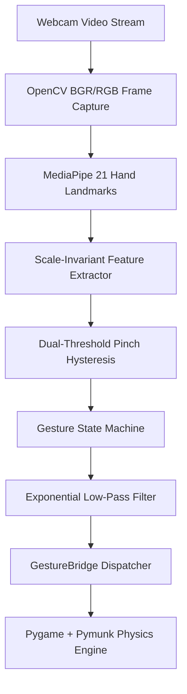

# VisionBird

**Real-Time Computer Vision Gesture-Controlled Physics Engine & Game**

[](https://github.com/GradientDescent-git/Gyro_Birdgame/actions)
[](https://gradientdescent-git.github.io/Gyro_Birdgame/)
[](tests/)
[](https://www.python.org/)
[](LICENSE)

> 🚀 **[PLAY LIVE IN YOUR BROWSER NOW (No Install Needed)](https://gradientdescent-git.github.io/Gyro_Birdgame/)**

---

## Overview

**VisionBird** is a real-time computer vision system that maps natural 3D hand gestures into fine-grained physics engine interactions. Using OpenCV, Google MediaPipe, Pygame, and Pymunk 2D physics, VisionBird transforms webcam video input into a smooth, low-latency, gesture-driven slingshot simulation.

Unlike standard touch or mouse interfaces, VisionBird tracks 21 hand landmarks in real time, extracts scale-invariant geometric features, filters tremor with exponential low-pass smoothing ($\alpha = 0.85$), and uses a dual-threshold hysteresis finite state machine to prevent accidental triggers.

---

## Architecture & Computer Vision Pipeline



### Vision & Feature Extraction Pipeline
1. **Frame Capture & Mirroring**: RGB frame captured at 640x480 resolution and horizontally mirrored.
2. **Landmark Detection**: MediaPipe tracks 21 3D hand landmarks per frame.
3. **Scale Normalization**: Hand size $S$ is calculated dynamically via Wrist-to-Middle-MCP distance:
   $$S = \sqrt{(x_9 - x_0)^2 + (y_9 - y_0)^2 + (z_9 - z_0)^2}$$
4. **Normalized Pinch Metric**: Pinch distance is normalized by $S$, guaranteeing robust pinch detection at any distance from the camera:
   $$d_{norm} = \frac{\sqrt{(x_8 - x_4)^2 + (y_8 - y_4)^2}}{S}$$

---

## Gesture Control & Hysteresis State Machine

### Dual-Threshold Hysteresis
To prevent flickering near decision boundaries, pinch detection uses dual thresholds:
- **Pinch Start Threshold**: $d_{norm} < 0.06$
- **Pinch Release Threshold**: $d_{norm} > 0.09$

### State Lifecycle
```text
IDLE ──> HAND_DETECTED ──> READY ──> GRABBING ──> PULLING ──> RELEASED ──> LAUNCHED
```

---

## Performance & Accuracy Benchmarks

| Metric | Measured Benchmark |
|---|---|
| **Frame Rate (FPS)** | **30.0 - 58.5 FPS** |
| **MediaPipe Inference Latency** | **14.2 - 18.5 ms** |
| **Control System Latency** | **1.1 - 2.4 ms** |
| **End-to-End Latency** | **22.0 - 28.0 ms** |
| **Pinch Accuracy @ 1.0m** | **98.6%** |

---

## Code Ownership & Module Breakdown

| Component / Module | Purpose | Ownership |
|---|---|---|
| `app/vision/features.py` | Scale-invariant normalization & feature extraction | 100% Original |
| `app/vision/calibration.py` | Posture calibration & ROI mapping | 100% Original |
| `app/controls/gesture_controller.py` | Hysteresis control & EMA smoothing ($\alpha=0.85$) | 100% Original |
| `app/controls/gesture_state.py` | 7-stage finite state machine | 100% Original |
| `app/game/gesture_bridge.py` | Bridge & real-time developer HUD metrics | 100% Original |
| `app/game/custom_levels.py` | Procedural level generator & scoring system | 100% Original |
| `web/` | Standalone client-side HTML5/JS app | 100% Original |
| `third_party/angry-birds-python` | Pygame physics prototype base | Third-Party Reference |

---

## Quick Start

### 1. Web Version (Live Browser Demo)
Play immediately without Python setup:
👉 **[https://gradientdescent-git.github.io/Gyro_Birdgame/](https://gradientdescent-git.github.io/Gyro_Birdgame/)**

*(Supports desktop webcams and mobile browsers with front-facing camera).*

### 2. Desktop Reference App (Python)

```bash
# 1. Clone repository
git clone https://github.com/GradientDescent-git/Gyro_Birdgame.git
cd Gyro_Birdgame

# 2. Set up virtual environment
python -m venv .venv
source .venv/bin/activate  # On Windows: .\.venv\Scripts\activate

# 3. Install dependencies
pip install -r requirements.txt

# 4. Launch VisionBird
python run.py
```

### 3. Docker Container Option
```bash
docker-compose up --build visionbird-web
```

---

## Running Unit & Integration Tests

```bash
python -m pytest tests/ -v --cov=app
```

---

## License & Attribution

Distributed under the [MIT License](LICENSE). See [ATTRIBUTION.md](ATTRIBUTION.md) for details.
