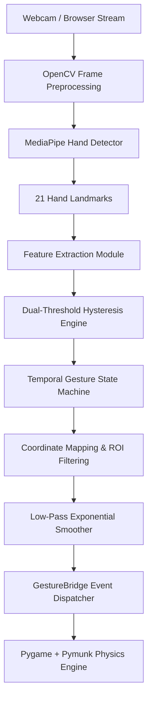

# VisionBird — System Architecture

VisionBird is structured as a real-time computer vision processing pipeline connected to a 2D physics game simulation.

## System Subsystems

### 1. Vision Subsystem (`app/vision/`)
- `hand_tracker.py`: Initializes MediaPipe Hands pipeline, converts BGR/RGB color spaces, handles frame capture errors.
- `features.py`: Extracts Euclidean landmark distances, computes wrist-to-MCP hand scale normalization, and detects gesture landmarks.
- `calibration.py`: Computes rest position baselines, ROI bounding boxes, and custom sensitivity bounds.

### 2. Control Subsystem (`app/controls/`)
- `gesture_state.py`: Finite state machine (`IDLE` -> `HAND_DETECTED` -> `READY` -> `GRABBING` -> `PULLING` -> `RELEASED` -> `LAUNCHED`).
- `gesture_controller.py`: Implements hysteresis thresholds (`PINCH_START_THRESHOLD` vs `PINCH_RELEASE_THRESHOLD`), exponential position smoothing, deadzone filtering, and relative anchor displacement.
- `gesture_mouse.py`: Handles fallback mouse events.

### 3. Game Subsystem (`app/game/`)
- `gesture_bridge.py`: Unified interface bridging CV features into Pygame events, featuring live developer debug HUD metrics.
- `game_controller.py`: Application entry point orchestrating game initialization and teardown.
