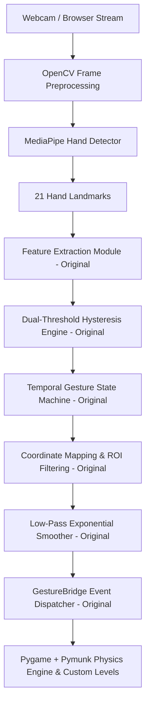

# VisionBird — Architecture & Module Ownership Breakdown

## System Subsystems

## Module Ownership & Originality Breakdown

| Component / File | Category | Description | Ownership |
|---|---|---|---|
| `app/vision/features.py` | **Core CV** | Scale-invariant normalization & feature extraction | 100% Original |
| `app/vision/calibration.py` | **Core CV** | Posture calibration & ROI mapping | 100% Original |
| `app/controls/gesture_controller.py` | **Control** | Dual-threshold hysteresis & EMA smoothing | 100% Original |
| `app/controls/gesture_state.py` | **Control** | 7-stage finite state machine | 100% Original |
| `app/game/gesture_bridge.py` | **Bridge** | Event dispatcher & real-time debug HUD | 100% Original |
| `app/game/custom_levels.py` | **Game** | Procedural level generator & score system | 100% Original |
| `web/` (HTML5/JS App) | **Web** | Web MediaPipe + Canvas physics game | 100% Original |
| `.github/workflows/` | **DevOps** | CI/CD testing & GitHub Pages deployment | 100% Original |
| `tests/` | **Testing** | Automated Pytest unit & integration test suite | 100% Original |
| `third_party/angry-birds-python` | **Base Assets** | Original open-source Pygame physics prototype base | Third-Party Reference |
